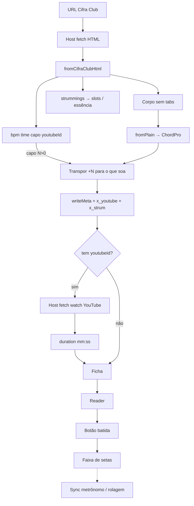

# Plano consolidado — import Cifra Club + batidas

**Status:** aprovado · **implementado** (2026-09-11)  
**Referência:** https://www.cifraclub.com.br/florianopolis-house-of-prayer/tu-es-aguas-purificadoras/

Notas de pesquisa (não são o plano): `cifraclub-magia-2026-09-11.md`, `batidas-cifraclub-extracao-2026-09-11.md`, `batidas-essencia-2026-09-11.md`.

---

## 1. Decisões fechadas

| Tema | Decisão |
|------|---------|
| Versão da cifra | Sempre a **Principal** (URL padrão do CC) |
| Tempo | Extrair `strummings[0].bpm` → `{tempo:}` |
| Compasso | Inferir da grade `timeSignature` → `{time:4/4}` (8 ou 16 slots) |
| Capo | Titan **já tem** `{capo:N}` + dual. CC escreve **formas**; import **transpõe +N** para o que **soa** e grava `{capo:N}` |
| YouTube | `metadata.youtubeID` (clipe, não a aula) → `{x_youtube:}` + link |
| Duração | Buscar watch page YT (`lengthSeconds` / `PT…`) → preencher `{duration:}` automaticamente; se falhar, pedir na ficha |
| Passagens `( Am G )` | **Não** converter (pode ser nota ou acorde longo) |
| Batidas | **Sim** — setas cheia/vazia + 4 essências |
| UI da batida | **Botão** mostrar/ocultar; pode ir com rolagem/metrônomo; usuário escolhe |
| Fora de escopo | Simplificada, shapes/diagramas, API v3 do CC, amarração batida↔letra |

---

## 2. O que já funciona (não refazer)

- Corpo via `<pre data-chord-content>` + pares `.kvMV`
- Strip de `.tabs` / tablatura
- Intro → `{c:INTRODUÇÃO}`; `[Refrão]` → `{soc}` (branco fecha)
- Pontos de ataque na letra (`f.az`)
- Título / artista (JSON-LD) / tom (`--chord-tone`)

---

## 3. Meta a extrair do HTML

Origem principal: `songData` no flight RSC (regex pontual; API REST dá 401).  
Compositores no JSON-LD — opcional, não bloqueia.

| Campo CC | Destino Titan |
|----------|---------------|
| `strummings[].bpm` | `{tempo:N}` |
| `timeSignature` (16→semicolcheia, 8→colcheia, tempos 1…4) | `{time:4/4}` |
| `config.capo` + `keyShape` / tom UI | transpor corpo + `{key: soa}` + `{capo:N}` se N>0 |
| `metadata.youtubeID` | `{x_youtube:ID}` |
| watch YT (host) | `{duration:mm:ss}` |
| `strummings[]` | `{x_strum:…}` (ver §4) |

`writeMeta` / `META_KEYS` passam a carregar de ponta a ponta: `capo`, `x_youtube`, `x_strum` (hoje `capo` é lido no parse mas o header do import não o canoniza).

---

## 4. Batidas

### 4.1 Dados

Cada item em `songData.strummings[]`:

- `bpm`, `section`, `timeSignature[]`, `pattern[]` (um código por slot)
- Grade 8 ou 16; `pattern.length` múltiplo = N compassos
- Várias seções → importar todas; padrão = primeira; seletor se `length > 1`

### 4.2 Vocabulário visual (essência — não 24 símbolos)

| Camada | Valores | Visual |
|--------|---------|--------|
| Direção | ↓ / ↑ | seta |
| Contato | toca / passa / pausa | seta **cheia** / seta **vazia** / vazio |
| Essência (só no toque) | **normal** · **acento** · **mute** · **abafada** | peso/marca na seta cheia |

Marcas sugeridas (glyph final na implementação):

- **normal** — seta cheia padrão  
- **acento** — seta mais grossa  
- **mute** — palm (ponto / haste curta)  
- **abafada** — tracejada ou X leve  

### 4.3 Mapa código CC → Titan

| Códigos | Contato | Direção | Essência |
|---------|---------|---------|----------|
| 7, 19 | toca | ↓ / ↑ | normal |
| 3, 15, 6, 18, 11 | toca | ↓ / ↑ | **normal** (agudas/bordões/rasqueado colapsam) |
| 1, 13, 2, 14, 5, 17, 10 | toca | ↓ / ↑ | acento |
| 8, 20 | toca | ↓ / ↑ | **acento** (palm+acento: acento vence no v1) |
| 9, 21 | toca | ↓ / ↑ | mute |
| 0, 12, 4, 16, 22 | toca | ↓ / ↑ / — | abafada |
| **23** | **passa** | pelo índice (par↓ ímpar↑) | — |
| **24** | **pausa** | — | — |

`0–11` = baixo, `12–21` = cima (`+12`). Rasqueado só existe para baixo no enum CC.

### 4.4 Modelo interno

```ts
type StrumContact = 'hit' | 'ghost' | 'rest'
type StrumDir = 'down' | 'up' | null
type StrumEssence = 'normal' | 'accent' | 'mute' | 'muted' // muted = abafada

type StrumSlot = {
  dir: StrumDir
  contact: StrumContact
  essence: StrumEssence | null // null se ghost/rest
}
```

### 4.5 Persistência (proposta)

```text
{x_strum: bpm=71; meter=4/4; grid=16; label=Padrão; pat=D..UgU D..UgU D.DU}
```

Compactação: `D`/`U` normal · `D!`/`U!` acento · `Dm`/`Um` mute · `Da`/`Ua` abafada · `d`/`u` ghost · `-` pausa.

### 4.6 UI

- Botão na chrome: exibir / ocultar  
- Faixa de setas alinhada à grade; slot ativo pode destacar com metrônomo/rolagem  
- Preferência de visibilidade na sessão (não forçar ligado)  
- Sem `strummings` → botão ausente/desabilitado, sem erro  

---

## 5. Capo (semântica)

| | Cifra Club | Titan |
|--|------------|-------|
| Acordes escritos | formas (com capo) | o que **soa** |
| `{capo:N}` | config | calcula formas = soa − N (dual) |

Import com `capo > 0`: `transposeTextChords(+N)` no ChordPro; `{key:}` = tom das formas + N; gravar `{capo:N}`.  
`capo === 0`: não escrever `{capo:}`.

---

## 6. Fluxo



Core **sem rede**. Host: fetch CC + fetch YT duration (demo: proxies tipo `__cifra_fetch` / `__youtube_duration`).

---

## 7. Superfícies

1. `src/core/import-chordpro.ts` — meta, strum→essência, capo transpose, `META_KEYS`/`writeMeta`
2. Helper YT duration (parser puro) + `demo/preview-plugin.ts`
3. `NewChartDialog.vue` — pré-preencher duration/tempo/time; copy “só o que falta”
4. Viewer — toggle + faixa de setas (4 essências)
5. Metrônomo — highlight do slot quando batida visível
6. Fixtures/testes: Tu És (bpm 71, 4/4, yt, strum); Wonderwall (capo 2, 32 slots); Céu Azul (`0` abafada + 2 seções)

---

## 8. Critérios de pronto

- FHOP sai com `{tempo:71}`, `{time:4/4}`, `{x_youtube:…}`, `{duration:07:57}` (se YT ok), `{x_strum:…}`
- Capo>0: acordes soam certo; dual mostra formas do CC
- Batida: toggle; cheia/vazia; normal/acento/mute/abafada conforme mapa
- `( … )` intocado; sem shapes; core sem `fetch`

---

## 9. Ordem de implementação

1. Extrair tempo / time / capo / youtubeId / strummings + testes de parse  
2. Capo: transpose + `{capo:}` + fixture capo>0  
3. `x_youtube` + duration via YT (host + diálogo)  
4. Slots + mapa de essência + `{x_strum:}` + UI toggle com setas  
5. Highlight metrônomo; seletor se várias batidas  
6. Copy da ficha  

---

## 10. Explicitamente fora (lembrete)

Simplificada · diagramas de acorde · batida amarrada à letra · 24 glyphs de técnica · API assinada do CC · converter `( Bm7 A/C# )`
