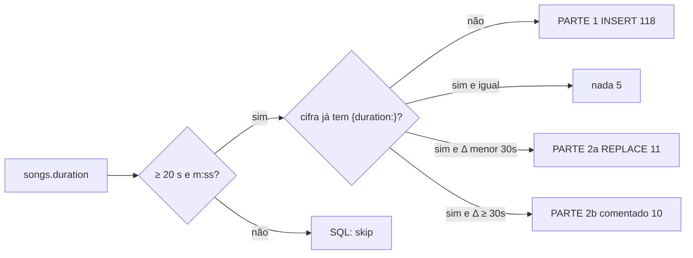

# Relatório — ChordPros de produção × `songs.duration`

**Data:** 2026-09-11  
**Corpus:** `db/songs.json` (1.353 músicas) + `db/chordpros.json` (157 cifras)  
**Motor usado:** parser, `lintSource`, `songDurationSec` / `hasSongDuration`, `isChord`, `looksLikeOnSong` e `buildTimeline` de `titan-chordpro-ui`  
**O que este trabalho não fez:** não alterou `db/*.json`, fixtures, cifras no repo, nem o banco. Só análise + SQL proposto.

Na sessão do metrônomo/auto-rolagem o Titan passou a **recusar rolagem sem `{duration:}`** (m:ss, ≥ 20 s). BPM e uma fileira `[G] [A] [B]` **não** substituem duração. As fixtures locais do ministério nasceram desse mesmo buraco. Este relatório responde: *o dump de produção está igual?*

Sim. **122 de 148 cifras vivas não têm `{duration:}`.** Sem o SQL, a auto-rolagem no viewer fica morta na maior parte do repertório cifrado.

---

## 1. Corpus

| Recorte | N |
|---|---:|
| Músicas (`songs`) | 1.353 |
| Músicas soft-deleted | 21 |
| Músicas com `duration` válida para o Titan | 1.301 |
| Músicas sem duração (null/inválida) | 52 |
| ChordPros | 157 |
| ChordPros vivos (`deleted_at` null) | **148** |
| ChordPros soft-deleted | 9 |
| Músicas distintas com pelo menos uma cifra | 145 |
| Tenant | 1 em 100% das linhas |

Status das **músicas que têm cifra viva:**

| `song_status_id` | Significado (SDA) | Cifras vivas |
|---|---|---:|
| 3 | em uso | 86 |
| 1 | a aprender | 55 |
| 2 | em treinamento | 7 |

Todas as 148 cifras vivas usam **CRLF** (`\r\n`). O parser normaliza; o SQL **preserva** CRLF. Nenhuma cifra viva veio como OnSong puro (acordes acima da letra sem `{title:}`).

Cifras com nome ≠ “Cifra padrão” (versões paralelas, as duas devem receber duração):

| id | song_id | name |
|---|---:|---|
| 7 | 5 | Versão Hinário 2022 |
| 11 | 956 | Versão Muralhas |
| 89 | 145 | Não sobe o tom |
| 131 | 86 | Não sobe o tom |
| 156 | 86 | Sobe o tom (original) |

---

## 2. Duração — achado principal

O Titan só liga auto-rolagem se a **cifra** declara `{duration:}` parseável (`m:ss` / `mm:ss` / `h:mm:ss` / segundos, 20 s … 3 h). A duração de produção mora em **`songs.duration`** (`MM:SS`, vinda em geral do YouTube).



### 2.1 Cifras vivas

| Situação | N | Auto-rolagem hoje |
|---|---:|---|
| Sem `{duration:}`, song tem duração | **118** | morta |
| `{duration:}` = `songs.duration` | 5 | ok |
| `{duration:}` ≠ song, \|Δ\| < 30 s | 11 | ok, relógio um pouco torto |
| `{duration:}` ≠ song, \|Δ\| ≥ 30 s | 10 | ok, mas o tempo da cifra **não** é o do song |
| Sem `{duration:}` **e** song sem duração | **4** | morta; SQL não inventa |

As 5 que já batem: ids **4, 104, 108, 149, 152** (Corpo e Família, Alvo mais que a neve, Trabalhar e Orar, Digno, Adoração/oferta).

### 2.2 Quatro cifras sem SoT em `songs.duration`

Não entram no SQL. Sem um número no song, não há o que copiar.

| chordpro id | song_id | título | status | YouTube |
|---:|---:|---|---|---|
| 30 | 27 | 028 Amor, amor, amor | em uso | — |
| 31 | 28 | 029 Vou em paz, com Jesus | em treinamento | — |
| 136 | 1309 | 094 Maranata (JA 2024) | a aprender | [sim](https://www.youtube.com/watch?v=BoWNEwIY0nI) |
| 144 | 1327 | 098 Usa-me | em uso | [sim](https://www.youtube.com/watch?v=txuPSdSn62M) |

094 e 098 podem ganhar duração com `php artisan sync:song-duration` no SDA e **depois** um `{duration:}` na cifra. 028 e 029 precisam de medição manual (não têm link).

A cifra **31** é a mais crua do dump: **zero meta** (`{title:}`, `{key:}`, `{tempo:}`, `{time:}`, `{duration:}`). Só letra+acordes.

### 2.3 `{duration:}` que já existe e discorda do song

`songs.duration` é a SoT que você pediu. Em 21 cifras o número **já escrito na cifra** não é o do song.

**Pequenos (2a, SQL ativo)** — provavelmente o mesmo take com arredondamento de YouTube:

| id | cifra | `{duration:}` | song | Δ |
|---:|---|---:|---:|---:|
| 5 | 005 Tua Vontade | 03:57 | 03:59 | +2 s |
| 6 | 006 Poder do Amor | 04:58 | 04:59 | +1 s |
| 7 | 006 Hinário 2022 | 04:58 | 04:59 | +1 s |
| 13 | 011 Meu Refúgio | 04:14 | 04:15 | +1 s |
| 99 | H016 Sublime Amor | 03:30 | 03:39 | +9 s |
| 111 | H321 Jesus é melhor | 03:35 | 03:54 | +19 s |
| 114 | H409 Amor no Lar | 02:50 | 03:04 | +14 s |
| 121 | H505 Muito Além do Sol | 03:30 | 03:38 | +8 s |
| 148 | H236 Transbordando em amor | 03:30 | 03:45 | +15 s |
| 151 | 078 Entrega (H310) | 04:26 | 04:40 | +14 s |
| 154 | 008 Vim para Adorar-te | 04:00 | 03:45 | −15 s |

**Grandes (2b, SQL comentado)** — cifra e song provavelmente descrevem **takes diferentes** (arranjo do ministério vs clipe). Aplicar cego deixa a rolagem 30–127 s fora do ensaio:

| id | cifra | `{duration:}` | song | Δ |
|---:|---|---:|---:|---:|
| 3 | 002 Em Gratidão | 03:20 | 02:30 | **−50 s** |
| 8 | 007 Vitória só vem do Senhor | 02:56 | 01:39 | **−77 s** |
| 10 | 009 Verdadeira alegria | 02:40 | 01:39 | **−61 s** |
| 11 | 009 Versão Muralhas | 02:40 | 01:39 | **−61 s** |
| 55 | 053 Vou testemunhar do amor | 05:30 | 03:23 | **−127 s** |
| 96 | H008 Ó Deus de Amor | 01:45 | 02:25 | +40 s |
| 101 | H024 Rei dos Reis | 01:30 | 02:23 | +53 s |
| 102 | H062 Quão grande és tu | 3:40 (sem zero) | 04:12 | +32 s |
| 109 | H245 Lado a Lado | 03:10 | 02:20 | −50 s |
| 115 | H440 Breve Jesus Voltará | 01:40 | 02:19 | +39 s |

**002 Em Gratidão** é o mesmo caso da fixture local (`fixtures/ministerio-tons/002-em-gratidao.cho` também tem `{duration: 03:20}`). O song de produção diz 02:30. Alguém mediu a cifra; o YouTube pode ser outro take. **Não** descomentei o UPDATE.

H062 é o único `{duration:}` **sem zero à esquerda** (`3:40`). O parser aceita; o SQL 2b (se um dia rodar) normaliza para `04:12`.

### 2.4 Ligação com as fixtures locais

O que a sessão anterior viu no disco é o espelho da produção:

| Fixture | `{duration:}` local | `songs.duration` |
|---|---|---|
| `002-em-gratidao.cho` | 03:20 | 02:30 (diverge) |
| `010-adoralo.cho` | — | 03:52 |
| `013-ele-vive-em-mim.cho` (+ partitura) | — | 04:30 |
| `014-em-ti.cho` | — | 05:21 |
| `015-esconderijo.cho` | — | 04:26 |
| `052-fidelidade-e-missao.cho` | — | 04:07 |
| `060-deixai-vir-pequeninos-h588.cho` | — | 01:05 |
| `088-minha-ofertinha.cho` | — | 01:12 |
| `094-maranata-ja-2024.cho` | — | **song também null** |
| `im003-imagine-o-ceu.cho` | — | 06:10 |
| `entrega-*.cho` | 04:26 | song 04:40 (cifra viva id 151) |

Depois do SQL, vale **re-exportar** as fixtures a partir das cifras atualizadas — senão o demo local continua sem rolagem.

---

## 3. O SQL gerado

Arquivo: [`db/update-chordpro-durations.sql`](./update-chordpro-durations.sql) (~270 KB).

**Onde:** banco **tenant** (não o landlord). Tabela `chordpros`.

**O que cada `UPDATE` faz:** reescreve a coluna `chordpro` **inteira**, mas a única edição de conteúdo é a linha `{duration: MM:SS}` (inserida depois da última meta, no mesmo critério de `patchMeta`, ou substituída no lugar). Letra, acordes, `{tempo:}`, `{key:}` ficam iguais. CRLF preservado.

**Trava:** `WHERE id = ? AND deleted_at IS NULL AND updated_at = '<timestamp do dump>'`. Se a cifra foi editada na produção depois do export, aquele id afeta **0 rows**.

| Parte | Qtd | Estado no arquivo | Efeito |
|---|---:|---|---|
| 1 INSERT | 118 | ativo | cifra que não tinha duração passa a ter a do song |
| 2a REPLACE \|Δ\|<30 s | 11 | ativo | alinha arredondamento |
| 2b REPLACE \|Δ\|≥30 s | 10 | **comentado** | só roda se você descomentar à mão |
| soft-deleted | 9 | fora | não toca |
| já iguais | 5 | fora | não toca |
| song sem duração | 4 | fora | não toca |

Transação única (`START TRANSACTION` … `COMMIT`). No fim há um `SELECT` das cifras vivas que **ainda** não têm `{duration:` — depois da parte 1+2a o esperado é **os 4 skip + os 10 da 2b** (e qualquer cifra nova que não estava no dump).

Não rode no landlord. Não rode duas vezes no mesmo estado: a segunda vez os `updated_at` já mudaram e tudo dá 0 rows (seguro, inútil).

---

## 4. Falhas estruturais (linter do Titan)

4 cifras vivas falham `lintSource`. O SQL **não** corrige isso.

### 4.1 Colchete de acorde sem par — 3 arquivos

**id 41 · 039 Falar com Deus · L15**

```chordpro
Fa[[D/A]lar com [A]Deus que privilégio
```

Um `[` a mais. Deveria ser `Fa[D/A]lar`.

**id 48 · 046 Verei Jesus (H455) · L36**

```chordpro
[C#m]   A voz de [A]De[us irá so[G#m]ar,    [B]//
```

`[us` foi lido como acorde. “Deus irá soar” partiu no lugar errado. O fechamento do `[A]` comeu o “us”. Forma típica: `De[A]us irá so[G#m]ar`.

**id 116 · H441 Vencendo vem Jesus · L13**

```chordpro
Ven[Bm]cendo [E]vem[ Je[A]sus
```

`[E]vem[` abre um acorde e não fecha. “Jesus” vira lixo de parse (`[ Je[A]`). Provável: `Ven[Bm]cendo [E]vem Je[A]sus`.

### 4.2 Refrão sem fechar — 1 arquivo

**id 55 · 053 Vou testemunhar do amor** — 4 `{soc}` × 5 `{eoc}`.

Há um `{eoc}` órfão por volta da L49 (bloco que começa na L44 **sem** `{soc}`). O linter não aponta a linha; o órfão é o da reprise do coro antes de `{c:(SOMENTE IGREJA)}`.

No mesmo arquivo, L72 está corrompida:

```chordpro
que minha vida seja pr[D]ova da existência do Sen[A]hoje
```

Nas reprises corretas é `Sen[A]hor`. “hoje” comeu “hor”.

Esta cifra também é o maior Δ de duração (−127 s). Está na 2b. Vale corrigir o source **antes** de qualquer replace de duração.

---

## 5. Acordes — notação, lixo e o que não é erro

O `isChord` do core aceita o dialeto BR comum (`C7M`, `D7(4)`, `Eb°`). Ainda assim 10 cifras têm tokens que ele recusa, e 15 têm aspas/apóstrofo colados no nome.

### 5.1 `C7+` / `Bb7+` / `D7+` — maj7 à brasileira

O `+` **depois** do 7 não entra no regex (C+ = aumentado; C7M / Cmaj7 = maior com sétima). Aparece em:

| id | título | tokens |
|---:|---|---|
| 6, 7 | 006 Poder do Amor | `[C7+]` |
| 51 | 049 Nas mãos do Oleiro | `[C7+]` (várias) |
| 54 | 052 Fidelidade é missão | `[Bb7+]`, `[B7+]` |
| 79 | 076 O amor vive | `[Db7+]` |
| 146 | 100 Nasce em mim | `[D7+]` |

Não é gramática. É notação que o Titan não promove a acorde. Equivalente usual: `C7M` / `Cmaj7`.

### 5.2 `D9/4` — sus4 à brasileira

**id 58 · 054 Inteiramente fiel (H311):** `[D9/4]`, `[G9/4]`. A barra no ChordPro é baixo (`D/F#`), não “9 com 4”. Forma que o engine aceita: `D7(4)` / `D9(4)` / `D9sus4`.

### 5.3 Aspas e apóstrofos dentro do colchete

OnSong/hinário às vezes marca *staccato* ou repetição com `"` / `'` / `’`. O Titan lê isso como parte do nome.

Exemplos: `[G"]` `[Am"]` (006), `[E']` (007, 012, 075, IM001), `[A’]` (081), `[D7’]` (082), `[Bm"]` (H496), `[A4"]` (101 Digno), `[Bm7''']` `[A']` (078 Entrega).

A letra em si não quebra; o acorde fica “inválido” na transposição.

### 5.4 Não é acorde inválido

`C7M`, `Gbm7`, `Esus4`, `A9`, `D/F#` — o engine aceita. `H` alemão também passaria; não apareceu como problema neste dump.

---

## 6. Letra, gramática e o que só parece erro

Muita “letra errada” neste corpus é **acorde no meio da vogal**. `mi[Em]im` vira `miim` se alguém stripa colchetes; na leitura o músico vê “mim”. `louvo[G]or` é “louvor”. **Não** tratei isso como erro gramatical.

Hífen de sílaba (`vonta - de`, `cris - to`, `univer - so`) em **27 cifras** é estilo de cifra para pousar o acorde, não português quebrado.

### 6.1 Erros reais de letra / digitação

**id 7 · 006 Poder do Amor (Hinário 2022) · L47** — a reprise final:

```chordpro
vi[D/F#]vendi dm ti je[Em]sus
```

Três erros numa linha: `vivendi` → vivendo; `dm ti` → em ti; `je sus` → Jesus. A estrofe equivalente mais acima já está melhor (`vivendi em ti jesus` ainda falha o “vivendo”). A versão “Cifra padrão” (id 6) desta música **não** tem esse trecho: o hinário foi que entrou torto.

**id 5 · 005 Tua Vontade** — cifra `Sejas meus olhos` / `guies o meu coração`. A letra em `songs.lyrics` é **“Seja meus olhos e guie o meu coração”**. Concordância da letra oficial (3ª pessoa). A cifra está na 2ª pessoa.

**id 8 · 007 Vitória só vem do Senhor** — `Se os problemas da vida nos fazer temer` → `fazem`.

**id 2 · 001 Tudo que há de bom em mim** — 1ª estrofe `provém de Deus` (bate com `songs.lyrics`); 2ª estrofe **`pertence de Deus`**. Pode ser variação de arranjo; não está na letra cadastrada.

**id 55 · 053** — `Sen[A]hoje` (já na §4.2).

**id 151 · 078 Entrega** — o `{eoc}` do 1º coro corta em `Por [E]onde` e a palavra **“for”** vazou para o interlúdio:

```chordpro
[A]for   [D]x///    [A]x///    [D]x/[E]//
```

O mesmo arquivo prefixa o coro com `*` (resto de outro formato) e usa `{keywords: Suave}` / `{book: Novo Hinário}` (o Titan ignora).

**id 74 · 071 Fiéis até o fim** — interlúdio:

```chordpro
[C]fim  [F]x/////   [C]x/////   [F]x/////
```

“fim” é letra solta numa linha que deveria ser só marca de compasso. Cinco `/` também é marca irregular (o relógio conta cada `/`; não é erro de parse).

### 6.2 O que o relatório **não** classifica como gramática

- Vogais longas (`ooo`, `aaaa`) — canto, não typo.
- `nao` / `voce` isolados — o dump é acentuado na maior parte; não varri falso positivo.
- HTML: **nenhuma** cifra viva tem `<br>` no ChordPro (o HTML mora em `songs.lyrics`, que é outro campo).

---

## 7. Meta da cifra × ficha da música

O SQL **não** alinha tom/BPM/compasso. Só duração. Divergências que o ensaio vai sentir:

### 7.1 Sem `{key:}` — 42 cifras vivas

A ficha tem tom; a cifra não. Transposição `setKey` no Titan **exige** `{key:}`. Lista longa; as que também discordam quando a cifra *tem* tom:

| id | título | song.key | cifra `{key:}` |
|---:|---|---|---|
| 30 | 028 Amor, amor, amor | Em | D |
| 46 | 044 Eu creio | F | D |
| 73 | 070 Medley Tal qual estou | F | E |
| 85 | 083 Fruto da criação | Am | F |
| 86 | 084 Escuta meu clamor | Em | **Gm** |
| 98 | H015 Tu és fiel | C | A |
| 100 | H021 Eu te amo ó Deus | F | E |
| 105 | H166 Caminhando | Bb | C |
| 115 | H440 Breve Jesus voltará | G | A |
| 119 | H487 Primeiro quero ver… | F | E |
| 120 | H496 Além do rio | G | A |
| 122 | HA201 Dia a dia | D | C |
| 131 / 156 | 087 Jesus, tu és a minha vida (não sobe / sobe) | A | G |
| 147 | 099 Ele é exaltado (Lúcio) | F | E |

Várias são **capo/versão** (“não sobe o tom”), não erro. 084 Gm vs Em e 044 F vs D merecem olho: não estão no nome da cifra.

### 7.2 BPM — 24 divergências

A maioria é ±1–10 BPM (YouTube vs metrônomo da cifra). As que **não** são ruído:

| id | título | song | cifra | nota |
|---:|---|---:|---:|---|
| 46 | 044 Eu creio | 62 | **130** | o dobro; um dos dois está errado |
| 86 | 084 Escuta meu clamor | 81 | 63 | junto com 6/8 vs 3/4 |
| 106 | H212 Bendita segurança | 60 | **150** + `{metronome: 180}` | três números no mesmo hino |
| 109 | H245 Lado a lado | 110 | 85 | |
| 121 | H505 Muito além do sol | 120 | **60** | metade |
| 129 | 068 Meu pastor | 68 | 91 | |

`{metronome:}` **não existe** no Titan. H212 declara `{tempo: 150}` e `{metronome: 180}`; o song diz 60 BPM em 9/8. A cifra está em 3/4. Relógio e metrônomo do viewer vão usar 150.

### 7.3 Compasso — 4 divergências (estas mexem no `x///`)

| id | título | song | cifra |
|---:|---|---|---|
| 86 | 084 Escuta meu clamor | 6/8 | 3/4 |
| 88 / 89 | 087 Jesus, tu és a minha vida | 12/8 | 4/4 |
| 106 | H212 Bendita segurança | 9/8 | 3/4 |

Em 6/8 / 9/8 / 12/8 o Titan conta o pulso composto (`beatsPerBar` 2 / 3 / 4, 3 marcas por pulso). Uma cifra 6/8 escrita como 3/4 **triplica ou distorce** o tempo das intros com `x///`. 084 é exatamente o caso da fixture `escuta-meu-clamor`.

### 7.4 Sem `{tempo:}` — 10 · sem `{time:}` — 3 · sem título — 1

Sem tempo: 31, 100, 103, 104, 113, 115, 118, 119, 122, 157.  
Sem `{time:}`: 31, 104, 122 (cai no default 4/4).  
Sem `{title:}`: só a **31**.

---

## 8. Linhas instrumentais sem `x///`

O relógio **não adivinha** uma fileira de acordes sem marca. Isso foi o diagnóstico da sessão do metrônomo. No dump vivo, só **3** cifras têm linha tocada-sem-letra sem `x///`:

| id | título | o quê |
|---:|---|---|
| **3** | 002 Em Gratidão | `{c: (SOLO INTRODUÇÃO)}` + `[G] [A] [G] [B] [D] [G] [B] [B] [A] [G]` — zero marcas. A intro de verdade na linha seguinte **tem** `x/`. O solo não entra no relógio. |
| 58 | 054 Inteiramente fiel | 1 linha instrumental sem marca |
| 77 | 074 Eu vou | 1 linha instrumental sem marca |

Nenhuma cifra viva estourou o teto (`timeline.over`): o `x///` contado **não** passa da duração do song. Ou seja, o problema de produção **não** é intro superestimada; é **falta de `{duration:}`** + um punhado de solos sem marca.

---

## 9. Diretivas que o Titan engole e ignora

| Diretiva | ids | Efeito no viewer |
|---|---|---|
| `{book: …}` | 151, 154, 157 | nenhum |
| `{keywords: …}` | 151, 157 | nenhum |
| `{metronome: 180}` | 106 | nenhum; o metrônomo usa `{tempo:}` |

Não quebram parse. `{metronome:}` em H212 é armadilha humana (parece que o andamento é 180).

id 151 (Entrega viva) ainda tem `(INTRODUÇÃO: …)` **sem** `{c:}` — vira letra/linha cantada, não comentário.

---

## 10. Soft-deleted (9) — fora do SQL

| id | song_id | título | `{duration:}` |
|---:|---:|---|---|
| 1 | 77 | 078 Entrega | 04:26 |
| 9 | 1071 | 008 Vim para adorar-te | 04:00 |
| 56 | 77 | 078 Entrega | 04:26 |
| 76 | 72 | 073 Levanto a cruz | — |
| 95 | 119 | H005 Jubilosos te adoramos | — |
| 130 | 86 | 087 Jesus, tu és a minha vida | — |
| 132–134 | 94 | 093 Eis-me aqui (3 cópias) | — |

A Entrega **viva** é a id **151**.

---

## 11. O que o SQL não resolve (backlog consciente)

Ordem sugerida **depois** de aplicar a PARTE 1 (e 2a, se concordar):

1. **Medir** 028, 029, 094, 098 e gravar `songs.duration` + `{duration:}` nas cifras.
2. **Decidir** os 10 Δ grandes (2b). Em Gratidão / Vitória / Verdadeira alegria / Testemunhar: a cifra é mais longa que o YouTube — se o ministério toca a cifra, **não** puxe o song para baixo.
3. Corrigir à mão os 4 lints (§4), em especial 053 (`{eoc}` órfão + `Senhoje`).
4. Hinário 006 L47 (`vivendi dm ti je sus`).
5. 005 Sejas/guies vs letra cadastrada.
6. `[A]for` na Entrega 151 e `[C]fim` em 071.
7. Notação `C7+` / `D9/4` se a transposição no palco importar.
8. 044 BPM 62 vs 130; H212 tempo/metronome/compasso; 084 6/8 vs 3/4; 087 12/8 vs 4/4.
9. Re-exportar fixtures `ministerio-tons/` a partir das cifras já com `{duration:}`.

Nada disso está no `.sql` de propósito: misturar correção de letra com UPDATE de 148 BLOBs é como perder o diff.

---

## 12. Como aplicar

```bash
# no tenant de PRODUÇÃO, depois de backup
mysql --default-character-set=utf8mb4 sda_tenant < db/update-chordpro-durations.sql
```

(Ajuste o nome do schema. Confirme que **não** é `sda_landlord` nem `*_testing`.)

Esperado com o dump ainda intacto:

- 118+11 = **129** rows com `updated_at` novo e `{duration:}` igual a `songs.duration`
- 10 cifras da 2b intactas
- 4 sem duração de song intactas
- 9 soft-deleted intactas

O `SELECT` final lista o que restou sem diretiva. Se listar dezenas de ids da PARTE 1, o `updated_at` do dump não bate mais com a produção — **não force**; reexporte e regenere.

---

## 13. Método (para auditar o relatório)

1. Cruzar `chordpros.song_id` → `songs.duration` / `key` / `tempo` / `time_signature` / `lyrics`.
2. `parse()` + `lintSource()` em cada `chordpro`.
3. `songDurationSec` (mesmo gate do viewer) em song e na diretiva.
4. Inserção de `{duration:}` só depois da última meta (`title/t/subtitle/st/artist/composer/key/tempo/time/duration/capo`), preservando `\r\n`.
5. `isChord` nos tokens; `isPlayedLine` + `lineBeats` nas instrumentais.
6. Timeline com alturas dummy (não é layout de tela): só para `over` / `k`. Nenhuma cifra viva com `over=true`.
7. Diff unificado de cada patch: **só** a linha de duração muda (0 diffs “largos”).

Dumps originais em `db/songs.json` e `db/chordpros.json` — **intactos**.
