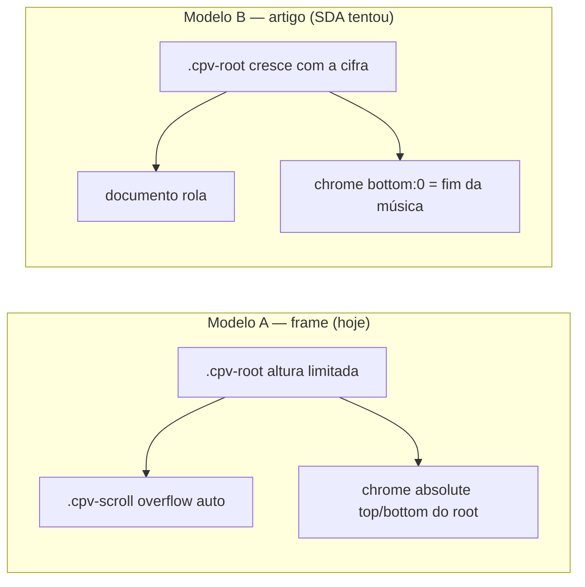

# Handoff — chrome de leitura no embed “artigo”

Data: 2026-09-06. Estado: diagnóstico do host fechado; **decisão de produto no Titan em aberto**.
Destinatário: **agent de design do Titan UI** (não o implementador SDA).
Base do viewer ao criar este documento: pacote instalado no SDA `titan-chordpro-ui@0.1.0` (`src/vue/ChordproViewer.vue`, `src/vue/cpv.css`).
Host que disparou: `/Volumes/External/code/sda`, página de música com cifra longa.

Este arquivo **não** pede um redesign visual da cifra, das cores ou dos controles. Pede para **repensar o modelo de superfície** quando o primeiro host real não é um frame 100dvh — e para **dizer se vale a pena** o Titan ganhar um segundo layout.

Não afirma que nada foi implementado. Não autoriza o host a continuar achatando `.cpv-scroll`.

---

## 1. Para quem e o que decidir

O agent de design do UI fecha **uma** destas saídas, por escrito, e devolve ao host:

| Saída | Significa |
|---|---|
| **A. Frame é a lei** | O Titan continua sendo uma superfície 1-cifra com scroller interno. Embed em artigo é problema do host (dimensionar o frame visível, ou sticky do **frame inteiro**, ou navegar para superfície 1-cifra). Documentar o contrato de forma inegável. |
| **B. Artigo é superfície de produto** | O Titan passa a ter um modo de leitura em fluxo de documento (a cifra cresce com a página). Aí o chrome, a rolagem, o zen, o auto-scroll e as folhas têm de ser **redesenhados**, não “grudados com sticky”. |
| **C. Terceiro caminho** | O agent inventa outra composição (ex.: a ficha da música **não** contém a cifra; a cifra é uma superfície própria). Também é decisão de produto, não CSS do host. |

A forma visual (vidro, raio, onde fica cada botão) continua **sua**. O modelo de interação e a filosofia abaixo são **vinculantes** enquanto a visão atual não for revogada.

---

## 2. Sintoma que chegou do host (já diagnosticado)

No frontend SDA, a **barra de controle da cifra** (rolar, A+/A−, ajuste, lentes, metrônomo, tema, export, tela cheia) aparece no **final da cifra**. Cifra grande → barra fora da tela. O músico não opera tom/rolagem enquanto lê o começo.

Hipótese do host: “nós removemos a barra de rolagem, talvez seja isso.”

**Confirmado: é isso, e é do host, não um bug de render do Titan.**

Cadeia:

1. Titan ancora o chrome com `position: absolute; bottom: 0` no `.cpv-root` (irmão de `.cpv-scroll`, não filho da cifra).
2. SDA frontend, na integração, forçou `.cpv-root { height: auto; overflow: visible }` e `.cpv-scroll { position: relative; overflow: visible }` — a cifra passou a crescer com o documento.
3. `bottom: 0` passou a significar “fim da música”.
4. O `stopPropagation` no `wheel` do host existia para o Titan não engolir a rolagem da página (`window` + `preventDefault` no overscroll do scroller interno).

Nova **não** fez isso: o host Nova já entrega `height: min(70vh, 760px); overflow: hidden` e a barra fica no frame.

Tentativas seguintes no SDA (frame `85dvh` no meio da ficha da música) tratam o sintoma errado: mesmo com o scroller restaurado, um retângulo de 85dvh que **começa abaixo da letra** ainda esconde a barra no fundo desse retângulo, abaixo da dobra.

O host pode consertar o achatamento **hoje**. O que o design agent precisa responder é se o **produto** quer que a cifra viva dentro de uma ficha longa (letra + cifra + arquivos + histórico) como o SDA faz, ou se isso é um abuso do contrato.

---

## 3. Contrato atual (minerado, não inventado)

### 3.1 Filosofia já ratificada

- **VISAO §3:** controles do músico na cifra (tom, rolagem, fonte, tema, export) são **do Titan**. Chrome de produto (menu, lista, auth, player) é **do host**. “Sem toolbar de app” ≠ “sem controles da cifra”.
- **VISAO §9 Q2 (aberta):** “Controles da cifra: barra no miolo vs chrome mínimo fixo (ainda ‘não-shell’).” **Esta pergunta nunca foi fechada.** O código escolheu chrome flutuante no frame; o host SDA tentou “miolo do documento”.
- **design-handoff/00-design-system.md:** overlays/folhas **contíveis no frame do viewer**, não `position: fixed` na viewport do browser do host.
- **design-handoff/01-screens.md:** embed **não vaza** UI para fora do frame. Superfície focada / shell-less. Uma mão, ensaio de pé.
- **design-source (viewer 1-cifra):** raiz `position: relative; height: 100dvh; min-height: 460px; overflow: hidden`. Área de leitura = **única** região rolável, `absolute; inset: 0; overflow-y: auto`. Barras flutuantes no topo e na base **desse** frame.

### 3.2 O que o código faz hoje

| Peça | Comportamento | Onde |
|---|---|---|
| `.cpv-root` | `relative; height: 100%; min-height: 460px; overflow: hidden` | `src/vue/cpv.css` |
| `.cpv-scroll` | `absolute; inset: 0; overflow-y: auto` | idem |
| Chrome inferior (wide) | `position: absolute; bottom: 0; left: 0; right: 0; z-index: 13` | `ChordproViewer.vue` (barra wide) |
| Chrome inferior (phone) | idem, com safe-area | mesma superfície, ramo compacto |
| Chrome superior | `position: absolute; top: 0; …; z-index: 12` | mesma superfície |
| Auto-hide | default `autoHide: true`; some após ~2,6 s parado **durante auto-scroll** | prop + `startScroll` |
| Zen | toque no vazio da cifra esconde/mostra chrome; toast na primeira vez | `toggleZen` / `onSurfaceTap` |
| Auto-scroll | RAF no **elemento** `.cpv-scroll`; playhead, linha de leitura, ETA | `startScroll` + `src/core/scroll.ts` |
| Wheel | listener no `window`, `{ passive: false }`; roda em cima do chrome ainda rola a cifra; `preventDefault` no overscroll | `onWheel` |
| Fit | reflow + leve auto-size **no container**; opt-in, nunca default | `fitDefault: false` |
| Fullscreen / imersivo | estado do app imediatamente; Fullscreen API em paralelo; `position: fixed; inset: 0` no root | `toggleFs` / `fakeFs` |
| Demo Titan | `html, body, #app { height: 100%; overflow: hidden }` + wrapper `height: 100%` | `demo/index.html`, `demo/App.vue` |

Não existe prop `layout`, `embed="article"` nem chrome `sticky`. O pacote **assume** que o ancestral imediato tem altura definida. Sem isso, `height: 100%` cai no `min-height: 460px` — ainda um frame, não um artigo.

### 3.3 Dois embeds reais no mesmo produto

| Host | Superfície | O que fez |
|---|---|---|
| **Nova** (cifra oficial) | Editor/admin, 1 campo | Frame `min(70vh, 760px)`, scroller interno intacto. **Contrato respeitado.** |
| **Frontend SDA** (músico) | Ficha da música: YouTube, metadados, **letra**, **cifra**, arquivos, histórico | Achatou o scroller para a página rolar. **Contrato violado.** Barra no fim da cifra. |
| **Demo Titan** | Viewport cheia | Frame 100%. **Contrato nativo.** |

O primeiro host declarado na visão é sda-v2 / SDA. O primeiro host **real** já tem duas superfícies conflitantes. Isso não apareceu no brief original da tela `viewer-1-cifra` (CP1: “host SDA fora do brief”).

---

## 4. Por que “sticky na barra” não é um ajuste

Se o agent (ou o host) só trocar o chrome de `absolute; bottom: 0` para `position: sticky` ou `fixed`, quebra ou briga com:

1. **Auto-scroll.** A matemática e o RAF leem `scroller.scrollTop` / `scrollHeight`. Sem scroller interno, o alvo passa a ser `window`/`document` — outro relógio, outra linha de leitura, outro “parar no fim”.
2. **Linha de leitura + progresso.** Posicionadas em px no frame. No artigo, “até aqui a cifra espera” deixa de ter um viewport próprio.
3. **Zen / auto-hide.** Esconder chrome que está no fluxo do documento empurra o conteúdo (layout shift) ou exige overlay que, se for `fixed`, **vaza do frame** — anti-padrão já escrito no DS.
4. **Fit ao espaço.** “Espaço” = container. No artigo o container é a página inteira; o modo ajuste perde o sentido ou vira “cabe na janela”, que é outro produto.
5. **Wheel no chrome.** Hoje, roda em cima da barra ainda pertence à cifra. No artigo, a barra sticky compete com a rolagem da ficha (letra acima, arquivos abaixo).
6. **Folhas / diálogos / metrônomo / export / edição.** Todos `position: absolute` no root. Root alto como a cifra → folhas no fim da música, o mesmo bug.
7. **Imersivo.** Já promove o root a `fixed; inset: 0`. Dois mundos (artigo vs palco) teriam de coexistir.
8. **Pad inferior da página (~124–140px + dock de auto-scroll).** Existe para a última linha não morrer **debaixo** da barra flutuante. No fluxo de documento esse padding vira um buraco no fim da cifra.

Não é um CSS de cinco linhas. É um **segundo viewer**.

---

## 5. Interação e filosofia (vinculantes neste rethink)

Não silenciar isto. A forma é livre; estes parâmetros não.

**Quem decide**

| Decisão | Dono |
|---|---|
| Tom, tema (salvo política `themeControl`), scroll on/off + afinação, fit on/off, bias, export, zen, imersivo | **Humano** (músico, uma mão) |
| Parse, HTML, math da velocidade-base, reflow do fit, playhead | **Sistema** (oculto) |
| Qual cifra está ativa, letra da ficha, player, nav, login | **Host** |
| Se a cifra **é** a superfície ou **mora dentro** de uma ficha | **Produto Titan** — é isto que este handoff pede para fechar |

**Cadência (calibração atual, melhorável na banda)**

- Ações de ensaio: gesto rápido de uma mão; feedback sub-segundo.
- Auto-scroll: base automática (duração → BPM → ~30 px/s); humano afina ~±12% por toque, faixa 0,3×–3×.
- Auto-hide do chrome: ~2,6 s parado **só com auto-scroll ligado** (default on). Zen é pedido explícito (toque no vazio).
- Fit **não** é default.
- Transpose só existe se a cifra tem key.
- Overlay/folha **não** sai do frame.

**Anti-padrões (não oferecer como “solução”)**

- `position: fixed` na viewport do host para “resolver” o embed artigo (vaza do frame; DS já proíbe).
- Dois chomes (um do host, um do Titan) para tom/rolagem/fonte.
- Multi-coluna.
- Pedir ao host que continue com `overflow: visible` no `.cpv-scroll`.
- Tratar a barra no fim da cifra como bug visual de contraste/tamanho — é geometria de containing block.
- Inventar um modo “sem scrollbar” que só esconde o overflow. Sem região rolável própria, o chrome absoluto **sempre** cai no fim do conteúdo.

**O que o redesign pode melhorar (legado, não congelar)**

- O chrome atual é **dois docks** (topo + base) flutuantes. VISAO 9.2 ainda pergunta se deveria ser mínimo / no miolo. Podem mudar **dentro do frame**.
- `min-height: 460px` é calibração, não dogma.
- Auto-hide 2,6 s é calibração.
- O host SDA ter letra **e** cifra na mesma página é legado do site, **não** está na visão do Titan. Questionar.

---

## 6. Vale a pena? (recomendação do host, o agent pode discordar)

### Não vale, no v0.1, um segundo layout “artigo” no Titan

Motivos, em ordem:

1. **A visão é 1-cifra em ensaio**, não ficha de catálogo. Auto-scroll, linha de leitura, zen, fit e imersivo só fazem sentido com um viewport de cifra.
2. **O demo e o Nova já estão no contrato.** Só um embed (frontend da ficha) quebrou. Generalizar o caso quebrado congela um abuso.
3. **Custo:** wheel, RAF, fit, folhas, zen, pad, imersivo — lista da §4. É um viewer paralelo, com suíte de browser própria, para um host que pode dimensionar um retângulo.
4. **Há saída no host sem mentir o CSS:** restaurar `.cpv-scroll`; dar ao frame a **altura do espaço visível restante** quando a cifra entra na tela; ou tornar o **frame inteiro** sticky; ou abrir a cifra em superfície própria (mesmo viewer, mesmo contrato).

### Vale o agent de design **repensar** estas três coisas (mesmo escolhendo A)

1. **Fechar VISAO §9 Q2.** Chrome flutuante no frame vs mínimo vs miolo — **dentro do frame**. A pergunta aberta foi o que deu licença mental ao host para achatar o scroller.
2. **Nomear o embed artigo.** A ficha SDA (letra + cifra + arquivos) é uma superfície de **host**. O brief original deixou “host SDA fora”. Resultado: o primeiro consumer real não tem composição. O DS precisa de uma frase do tipo: *o viewer ocupa um frame visível; se o host tem conteúdo acima/abaixo, o host recorta o restante da viewport ou promove a cifra a superfície; não desmonta o scroller.*
3. **Frame que começa no meio da página.** Mesmo obedecendo o contrato, `height: 85dvh` abaixo de uma letra longa deixa a barra inferior fora da dobra. Isso **é** problema de desenho de embed, não só de CSS. Opções de composição (forma livre, comportamento não):
   - a cifra **substitui** a letra na mesma vista (tabs/âncora já existem no SDA);
   - o frame tem altura = **espaço visível abaixo do cabeçalho da ficha**, não 85dvh mágicos;
   - o **frame inteiro** acompanha (sticky) enquanto a cifra está em cena — a barra continua absoluta **dentro** do frame;
   - a cifra é rota própria (ensaio), a ficha não embute o player.

### Só vale B (modo artigo no Titan) se o agent afirmar as três juntas

- O músico **deve** ler a cifra no fluxo da ficha, com a página do site rolando, **e** isso é produto Titan (não conveniência de um host).
- Auto-scroll, zen, fit e imersivo têm desenho **explícito** nesse modo (incluindo “desligados / escondidos”, se for o caso — omissão vira default errado).
- Folhas e chrome **continuam dentro do frame** (o frame, no modo artigo, precisa ser redefinido: o que é “frame” se o root cresce com a música?).

Se qualquer uma falhar, é A, não B.

---

## 7. O que o SDA fará enquanto o Titan decide

O host restaura o frame (scroller interno + altura limitada) e **não** trata “sumir com a scrollbar” como requisito. Nova permanece como referência de embed correto.

O host **não** pede ao Titan um patch tático de `sticky` enquanto esta decisão estiver aberta.

Página real de reprodução (cifra longa, letra acima):  
`http://127.0.0.1:8000/musicas/adoradores-1/escuta-meu-clamor/29Py44qB`

Fixture da mesma música no Titan: `fixtures/escuta-meu-clamor-sda-86.cho`.

---

## 8. Entregável esperado do agent de design

Um parecer curto (não um DS novo, a menos que escolham B/C):

1. **Saída A, B ou C** e por quê, contra VISAO §3 e §9 Q2.
2. Se A: texto de contrato de embed para `docs/EMBED-SDA.md` + README (o host precisa de altura; `.cpv-scroll` é sagrado; artigo = composição do host). Opcional: ajuste **dentro do frame** da Q2 (chrome mínimo vs dois docks) — só se quiserem gastar a rodada nisso.
3. Se B: **novo** brief da tela de leitura em artigo (interaction model completo: quem rola, o que some, o que acontece com auto-scroll/fit/zen/folhas/imersivo). Fixtures reais, não mocks. Sem `fixed` na viewport do host.
4. Se C: a superfície de ensaio (1-cifra) vs a ficha (metadados/letra) — quem contém quem.
5. O que **não** muda: parse, source como SoT, tema host já entregue, tokens de fonte, sem VisualAdapter, sem Vue no core.

Forma visual: silêncio. Não prescrever cor, raio, vidro, nem “a barra deve ser um pill no centro”.

---

## 9. Aceite se B for escolhido (não começar código antes)

| ID | Verificação |
|---|---|
| L1 | Cifra longa (fixture SDA 86 ou equivalente ≥ viewport): controles de leitura alcançáveis **sem** chegar ao fim da música, em desktop e móvel. |
| L2 | Auto-scroll tem alvo definido e para no fim; ou está explicitamente ausente nesse modo (não “meio funciona”). |
| L3 | Folhas (tom, metrônomo, export, lentes, edição) abrem no visível, não no fim da cifra. |
| L4 | Nenhuma UI `fixed` vaza para o shell do host (header/tema/nav do SDA). |
| L5 | Modo frame (demo + Nova) **não** regride: scroller interno, chrome absoluto no root. |
| L6 | Host frontend deixa de overridear `height`/`overflow`/`position` de `.cpv-root` / `.cpv-scroll`. |

L1–L6 são aceite de **produto**. Teste jsdom não prova geometria.

---

## 10. Fora deste recorte

- Colisão de acordes (V1), tema host (V2), tokens de fonte (V3) — outro handoff, já em curso.
- Implementação SDA, Nova, autenticação, conteúdo das cifras.
- Shell `titan-chordpro`, áudio sync, multicifra.
- “Esconder scrollbar com CSS” como requisito estético.

---

## 11. Referências

| Artefato | Papel |
|---|---|
| `docs/VISAO.md` §3, §9 Q2 | SoT de produto; pergunta aberta do chrome |
| `design-handoff/00-design-system.md` | Frame; overlays não vazam |
| `design-handoff/01-screens.md` | Viewer 1-cifra; embed |
| `src/vue/cpv.css` `.cpv-root` / `.cpv-scroll` | Frame implementado |
| `src/vue/ChordproViewer.vue` chrome + `onWheel` + `startScroll` | Chrome absoluto, wheel, RAF |
| `src/core/scroll.ts` | Math assume altura de conteúdo vs duração/BPM |
| `demo/index.html` | Embed canônico 100% |
| `docs/EMBED-SDA.md` | Contrato atual (tema/fonte); **omite** altura/scroller |
| `docs/HANDOFF-SDA-VIEWER-2026-09-06.md` | Handoff anterior; já notava rolagem aninhada como revisão separada |
| SDA `resources/css/inertia.css` `.sda-cpv-host` | Achatamento (causa) e tentativas de frame |
| SDA `resources/js/Pages/Songs/Detail.vue` | Ficha: letra depois cifra |
| SDA `resources/js/nova/chordpro-viewer/field.css` | Embed que respeita o frame |

Diagnóstico de integração (SDA): `.atomic-skills/reviews` no host, 2026-09-06.
